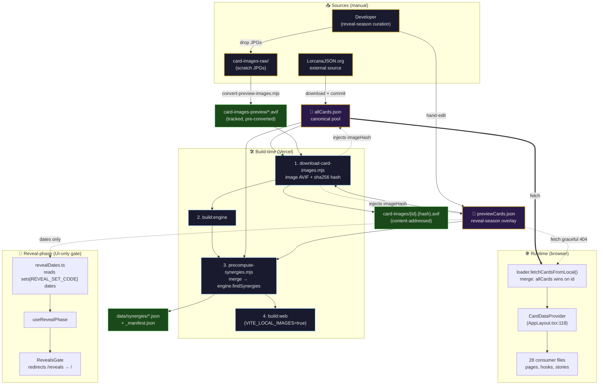
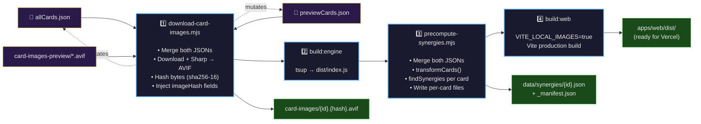
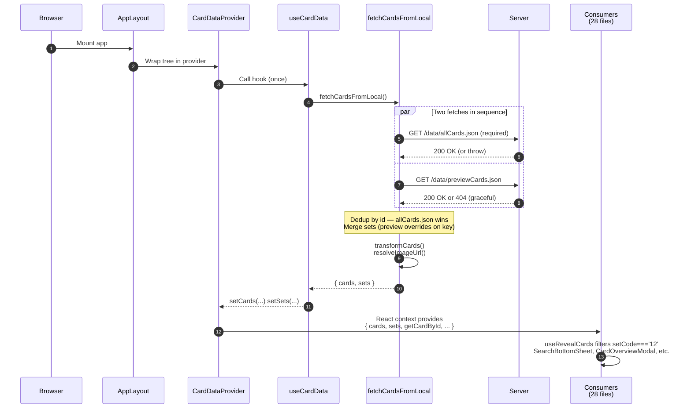
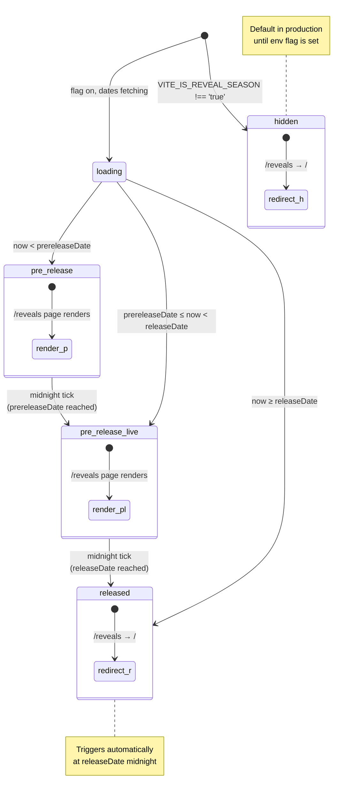
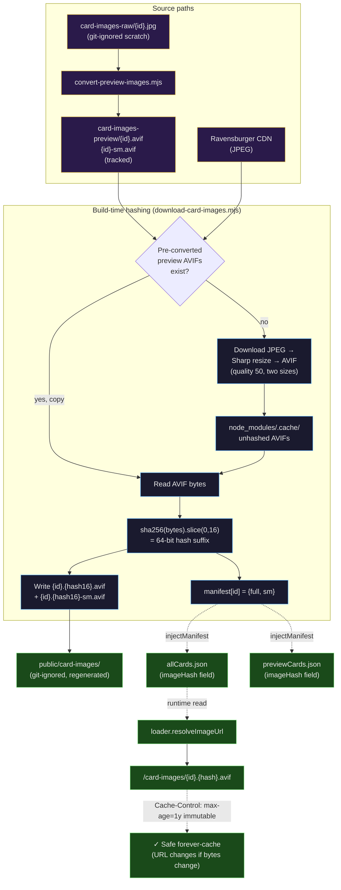
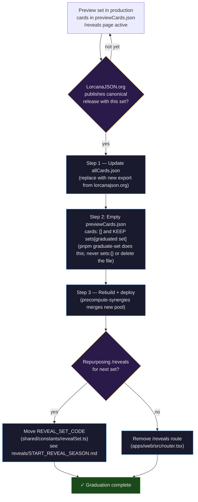

# Card Data Pipeline

End-to-end reference for how Lorcana card data flows from external source through the build pipeline into the runtime UI. Covers both the canonical `allCards.json` pool and the reveal-season `previewCards.json` overlay, plus the image and synergy precomputation stages that depend on them.

This doc was written by tracing every reference to both JSONs across the repo (scripts, hooks, Vite config, runtime code, tests, CDN headers). Every claim cites a file + line so the doc can be re-verified when code changes. If the cited lines no longer match the described behavior, the doc is stale — fix the code or fix the doc.

<blockquote class="callout callout-info">
<strong>How to read this doc</strong> — Skim the top-level diagram for the shape of the pipeline, then drop into whichever section names the problem you're debugging. The collapsible <em>File inventory</em> at the end is the index when you need to jump straight to a specific consumer.
</blockquote>

## Contents

- [Overview](#overview)
- [Top-level data flow](#top-level-data-flow)
- [The two source JSONs](#the-two-source-jsons)
- [Creation flow (manual)](#creation-flow-manual)
- [Build-time pipeline (Vercel production)](#build-time-pipeline-vercel-production)
- [Dev-time auto-rebuild](#dev-time-auto-rebuild)
- [Runtime data flow](#runtime-data-flow)
- [Reveal-phase machinery (separate from data merge)](#reveal-phase-machinery-separate-from-data-merge)
- [Image pipeline (content-addressed)](#image-pipeline-content-addressed)
- [File inventory](#file-inventory)
- [Graduation path](#graduation-path)
- [Known gaps and quirks](#known-gaps-and-quirks)
- [How to verify this doc is current](#how-to-verify-this-doc-is-current)

---

## Overview

Two JSON files sit at the root of the data layer:

- `apps/web/public/data/allCards.json` — canonical card pool, sourced manually from [LorcanaJSON.org](https://lorcanajson.org/)
- `apps/web/public/data/previewCards.json` — reveal-season overlay, manually curated before the canonical source publishes a new set

Both are tracked in git (no `.gitignore` entry for either). Both follow the same LorcanaJSON schema, defined by the `LorcanaJSONCard` interface in `packages/synergy-engine/src/utils/cardTransformer.ts`.

At build time, three scripts read both files, in this order:

1. `scripts/download-card-images.mjs` — image conversion + content-addressed hashing; mutates both JSONs to inject `imageHash` / `imageHashSm` fields
2. `scripts/precompute-synergies.mjs` — runs the synergy engine across the merged card pool; writes per-card synergy files to `apps/web/public/data/synergies/`
3. `pnpm build:web` — standard Vite build

At runtime, a single React context (`CardDataProvider` in `apps/web/src/shared/contexts/CardDataContext.tsx:12-30`) fetches both files once, merges them with `allCards.json` winning on id collision, and exposes the result to every consumer in the app.

A separate machinery — the **reveal phase** (`apps/web/src/features/reveals/useRevealPhase.ts`) — decides whether the `/reveals` page route is reachable. **It does not gate the data merge.** Preview cards are merged into the pool whenever `previewCards.json` exists, regardless of phase or flag.

---

## Top-level data flow



<blockquote class="callout callout-info">
<strong>Three independent paths share two inputs</strong> — Build-time merges both JSONs into image hashing AND synergy precomputation. Runtime merges them into the React context. The reveal-phase machinery reads only the <em>sets metadata</em> from <code>previewCards.json</code> (dates), never the cards. Each path's merge logic is independent — break one without breaking the others.
</blockquote>

---

## The two source JSONs

### `allCards.json` — canonical pool

| Property | Value | Evidence |
|---|---|---|
| Path | `apps/web/public/data/allCards.json` | direct |
| Schema | LorcanaJSON `formatVersion: 2.3.2` | `allCards.json:3` |
| Origin | External — [LorcanaJSON.org](https://lorcanajson.org/) | `README.md:124` |
| Generated in this repo? | **No** | Glob `scripts/generate-cards*`, `scripts/sync-cards*`, `scripts/fetch-cards*` all return zero |
| Tracked in git? | Yes | Not present in `.gitignore` |
| Current contents | 1,633 cards, sets 5–12 (post-Set-12 graduation 2026-05-13) | Direct inspection (Node `cards.length` + `Object.keys(sets)`) |
| Updated when | Manually, when LorcanaJSON.org publishes a new release | No automation found |

The expected card shape is the LorcanaJSON format defined by `LorcanaJSONCard` in `packages/synergy-engine/src/utils/cardTransformer.ts`. Notably:

- `id: number` (becomes `string` after transformation, line 111)
- `color: string` (parsed into `ink` + optional `ink2` for dual-ink cards, lines 53-65)
- `subtypes: string[]` — `Song` is split out into `isSong` (line 107) and removed from `classifications`; everything else goes into `classifications`
- `abilities: Array<{type, keyword, keywordValue, ...}>` — `transformCard` extracts native `keywords` and, via `collectKeywords`, synthesizes the conditional Shift and Singer a card grants to itself in ability text or in the card's own `fullText` (see [SHIFT_TARGET_RULE.md](../packages/synergy-engine/SHIFT_TARGET_RULE.md) and [SINGER_SONGS_RULE.md](../packages/synergy-engine/SINGER_SONGS_RULE.md))
- `franchise?: string` — **set only on preview cards** (e.g., `"Toy Story"`, `"The Incredibles"`, `"Brave"`). Used by `useRevealCards` to tier the reveal grid.
- `imageHash?: string` / `imageHashSm?: string` — content-addressed hash suffixes injected at build time by `download-card-images.mjs`. Used by `loader.ts:42-43` to build immutable image URLs in production.

### `previewCards.json` — reveal-season overlay

| Property | Value | Evidence |
|---|---|---|
| Path | `apps/web/public/data/previewCards.json` | direct |
| Schema | Same LorcanaJSON format | `previewCards.json:1-22` |
| Origin | Manual curation | `docs/superpowers/specs/2026-04-17-set12-preview-cards-design.md:20` (explicit Non-goal: no admin UI) |
| Tracked in git? | Yes | Not present in `.gitignore` |
| Current contents | In season: `sets[REVEAL_SET_CODE]` plus the cards revealed so far. Off season: `cards: []` with the graduated set's `sets` entry **preserved** (never `sets: {}`), so the reveal dates keep resolving | Direct inspection |
| Updated when | A new card is revealed publicly before the canonical source publishes the set | Manual `previewCards.json` edits |

Two side-effects when `previewCards.json` changes:

- **Hook auto-runs** `pnpm precompute-synergies` so synergy data refreshes. See `.claude/hooks/preview-data-auto-precompute.sh:32-46`.
- **Dev server detects** the change (mtime newer than `_manifest.json`) and triggers the same rebuild at boot. See `apps/web/vite.config.ts:30-34` (`ensureSynergiesPlugin`).

### Set 12 graduation history (resolved 2026-05-13)

<blockquote>
<strong>Verified complete</strong> — Set 12 was migrated from hand-curated preview entries to canonical LorcanaJSON data. <code>allCards.json</code> now carries 204 canonical Set 12 cards (permanent LorcanaJSON ids 2716–2919); <code>previewCards.json</code> is reset to empty. The migration ran through <code>scripts/graduate-canonical-set.mjs</code>, which is the reusable reference implementation for all future set graduations.
</blockquote>

**Historical context:** From 2026-04-17 to 2026-05-13 both files carried the same 204 hand-curated Set 12 entries with composite preview ids like `121204` (`<set><number><total>`). The dedup logic in `loader.ts:179-180` silently masked the `previewCards.json` entries. The 2026-05-13 migration replaced all entries with canonical data atomically, dropping 51 variant-rarity printings (Epic / Iconic / Enchanted / Special) per [Rule 1](#rules-during-canonical-integration) and stripping extra LorcanaJSON metadata fields per Rules 4-6. (Since #625, Rule 1 folds Epic / Iconic / Enchanted into the base card's `variants` instead; `pnpm sync-variants` backfilled them for sets 9-13.)

Effect of the graduation:
- Set 12 card ids changed from composite preview ids (`121204`, `122204`, ...) to LorcanaJSON sequential ids (`2716`, `2717`, ...) — any shared pre-graduation URLs break by design
- 10 cards got name corrections from canonical (e.g., "Spellbound Queen" → "Bespelled Queen", "Seasoned Traveler" → "Experienced Traveler")
- Synergy data fully regenerated; total matches went from 19,020 → 19,351 (~1.7% increase) reflecting canonical text differences from preview curation

Per the original design (`docs/superpowers/specs/2026-04-17-set12-preview-cards-design.md:114-123`), the graduation path was:

1. Update `allCards.json` with the regenerated export ✅
2. Empty `previewCards.json` ✅
3. Deactivate the `/reveals` route ✅ (handled via `VITE_IS_REVEAL_SEASON=false` flag flip in production)

All three steps executed cleanly. After a graduation `previewCards.json` carries `cards: []` and keeps the graduated set's `sets` entry (not `sets: {}`), ready for the next reveal season. **To start that season, follow [`reveals/START_REVEAL_SEASON.md`](reveals/START_REVEAL_SEASON.md)**; the schema reference under [Updating `previewCards.json`](#updating-previewcardsjson) gives the shape new entries should follow.

---

## Creation flow (manual)

**There is no script in this repo that generates `allCards.json` or `previewCards.json`.** Both are hand-committed.

Negative-claim evidence:

- Glob `scripts/generate-cards*` — no files found
- Glob `scripts/sync-cards*` — no files found
- Glob `scripts/fetch-cards*` — no files found
- Full `ls scripts/` returns exactly 7 files: `audit-synergy-data.mjs`, `codescene-gate.mjs`, `convert-preview-images.mjs`, `download-card-images.mjs`, `generate-docs.mjs`, `precompute-synergies.mjs`, `test-supabase-integration.mjs`. None of these create cards from scratch.
- Grep `lorcanajson\.org|api.lorcanajson` across the repo — only the README mention, no fetch code
- Grep `previewCards\|allCards` in `.github/workflows/` — no matches; CI doesn't touch the JSONs

### Updating `allCards.json`

1. Download the latest `allCards.json` from [lorcanajson.org](https://lorcanajson.org/)
2. Replace `apps/web/public/data/allCards.json` directly
3. Commit
4. The dev server (`ensureSynergiesPlugin`) will detect the staleness and run `pnpm build:engine && pnpm precompute-synergies` automatically on next `pnpm dev`. For production, `vercel.json:2`'s build command runs the same scripts.

### Updating `previewCards.json`

1. Edit `apps/web/public/data/previewCards.json` directly — append new cards in the LorcanaJSON shape (full schema in the collapsible below). To scrape a revealed card straight from its source page into this shape, paste the browser-console parser from [`docs/PREVIEW_CARD_PARSER.md`](https://github.com/Doberjohn/inkweave-admin/blob/main/docs/PREVIEW_CARD_PARSER.md) in Doberjohn/inkweave-admin into devtools — it downloads a ready-to-paste `{id}-{slug}.json`.
2. (Optional) Drop raw JPGs in `apps/web/public/card-images-raw/` named `{id}.jpg` (or `.jpeg`/`.png`/`.webp`). The `preview-images-auto-convert.sh` hook fires `pnpm convert-preview-images` which produces the AVIFs at `apps/web/public/card-images-preview/{id}.avif` + `{id}-sm.avif`.
3. The `preview-data-auto-precompute.sh` hook fires `pnpm precompute-synergies`
4. Commit

The folder `apps/web/public/data/set12/` is a **personal scratch staging area** — git-ignored per `.gitignore:68`. Per-card source JSONs accumulated there are not the runtime contract; `previewCards.json` itself is.

<details>
<summary><strong>Preview card schema</strong> — reference for adding Set 13+ reveal cards</summary>

The file lives at `apps/web/public/data/previewCards.json`. Post-Set-12 graduation it carries the empty template below — populate `sets[code]` with the new set's metadata and append entries to `cards[]`.

**Post-graduation template (current state):**

```json
{
  "metadata": {
    "formatVersion": "2.3.2",
    "generatedOn": "2026-05-13T17:00:00",
    "language": "en"
  },
  "sets": {
    "12": {
      "name": "The Wilds Unknown",
      "number": 12,
      "prereleaseDate": "2026-05-08",
      "releaseDate": "2026-05-15",
      "hasAllCards": true,
      ...
    }
  },
  "cards": []
}
```

`cards: []` is empty after graduation but `sets[setCode]` metadata is **preserved** — `fetchRevealDates` (`revealDates.ts`) reads dates from this file, so emptying `sets` entirely would break `useRevealPhase` for the just-graduated set. The next graduation overwrites `sets` with the next set's metadata, naturally retiring the previous entry.

**Top-level fields:**

| Key | Required | Purpose |
|---|---|---|
| `metadata.formatVersion` | Yes | LorcanaJSON schema version — match what's in `allCards.json` so it's a single conceptual format |
| `metadata.generatedOn` | Yes | ISO timestamp. Refresh on each edit (the Vite plugin's staleness check looks at file mtime; the timestamp inside is for human-readable provenance) |
| `metadata.language` | Yes | Always `"en"` |
| `sets` | Yes | Set metadata keyed by string set code (e.g., `"14"`). `fetchRevealDates` (`revealDates.ts`) reads `sets[REVEAL_SET_CODE]` for the `/reveals` page dates |
| `cards` | Yes | Array of preview card entries |

**`sets[code]` entry — set metadata:**

```json
"13": {
  "name": "Set 13 Display Name",
  "number": 13,
  "type": "expansion",
  "prereleaseDate": "2026-08-15",
  "releaseDate": "2026-08-22",
  "hasAllCards": false,
  "allowedInFormats": {
    "Core": {"allowed": true, "rotationGroup": 2}
  }
}
```

| Field | Required | Purpose |
|---|---|---|
| `name` | Yes | Display name shown on `/reveals` and set selector |
| `number` | Yes | Numeric set number |
| `type` | Yes | Usually `"expansion"`; could be `"promo"` for promo sets |
| `prereleaseDate` / `releaseDate` | **Yes (for reveals)** | Local-midnight dates (`YYYY-MM-DD`). Drive the `/reveals` page's phase machinery — see [Reveal-phase machinery](#reveal-phase-machinery-separate-from-data-merge). Without these, the phase computation returns `null` and `/reveals` page stays in loading. |
| `hasAllCards` | Yes | `false` during reveal season, `true` after graduation. Currently informational only — no app logic consumes it. |
| `allowedInFormats` | Yes | Format eligibility. Inkweave consumes `Core.rotationGroup` indirectly via filter UI; `allowed: true` is the typical value. |

**`cards[]` entry — annotated example:**

```json
{
  "id": 14001,
  "name": "Sample Card",
  "version": "Subtitle Description",
  "fullName": "Sample Card - Subtitle Description",
  "cost": 3,
  "color": "Amber",
  "inkwell": true,
  "type": "Character",
  "subtypes": ["Storyborn", "Hero", "Princess"],
  "abilities": [
    {
      "type": "static",
      "name": "ABILITY NAME",
      "effect": "Effect text describing what the ability does.",
      "fullText": "ABILITY NAME Effect text describing what the ability does."
    },
    {
      "type": "keyword",
      "keyword": "Singer",
      "keywordValue": "5",
      "fullText": "Singer 5 (This character counts as cost 5 to sing songs.)"
    }
  ],
  "fullText": "ABILITY NAME Effect text describing what the ability does.\nSinger 5 (This character counts as cost 5 to sing songs.)",
  "fullTextSections": [
    "ABILITY NAME Effect text describing what the ability does.",
    "Singer 5 (This character counts as cost 5 to sing songs.)"
  ],
  "strength": 2,
  "willpower": 3,
  "lore": 2,
  "setCode": "13",
  "number": 1,
  "rarity": "Common",
  "franchise": "Frozen",
  "images": {
    "thumbnail": "https://lorcanaplayer.com/wp-content/uploads/.../sample-430x600.jpg",
    "full": "https://lorcanaplayer.com/wp-content/uploads/.../sample.jpg"
  }
}
```

| Field | Required | Notes |
|---|---|---|
| `id` | Yes | Numeric: `REVEAL_ID_BASE + collector number`, i.e. `setNumber * 1000 + number` (Set 14 #1 → `14001`). A card revealed without a collector number takes an id in the reserved `+900..+999` band and omits `number`. Enforced by `reveal-set-integrity.test.ts`, which also rejects an id that collides with `allCards.json`. Graduation replaces these with canonical LorcanaJSON ids. |
| `name` | Yes | Card's primary name (e.g., `"Mickey Mouse"`) |
| `version` | Optional | Subtitle (e.g., `"Brave Little Tailor"`) |
| `fullName` | Yes | `"{name} - {version}"` when version present, else just `name`. Used for many lookups. |
| `cost` | Yes | Ink cost (number) |
| `color` | Yes | Single ink (e.g., `"Amber"`) or dual-ink (`"Amethyst-Sapphire"`). See `VALID_INKS` in `cardTransformer.ts` for valid inks: Amber, Amethyst, Emerald, Ruby, Sapphire, Steel. |
| `inkwell` | Yes | Boolean — can this card be inked? |
| `type` | Yes | `"Character"`, `"Action"`, `"Item"`, or `"Location"` (`VALID_TYPES` in `cardTransformer.ts`) |
| `subtypes` | Optional | Array of classifications. `"Song"` here marks Action cards as singable (transformer pulls it out into `isSong`). |
| `abilities` | Optional | Array of ability objects. Each has `type` (`"static"`, `"triggered"`, `"keyword"`, `"activated"`, etc.). Keyword abilities use the `{type: "keyword", keyword: "Singer", keywordValue: "5"}` shape — the transformer's `nativeKeywords` reads these. |
| `fullText` | Optional | Combined ability text — searchable |
| `fullTextSections` | Optional | Array of ability text blocks — preserves card layout for UI rendering |
| `strength` / `willpower` / `lore` | Conditional | Required for Characters. Other types vary. Missing `strength` defaults to 0 for Characters per `transformCard` in `cardTransformer.ts`. |
| `moveCost` | Conditional | Locations only — cost to move characters there |
| `keywordAbilities` | Optional | Array of keyword name strings — alternative to embedding in `abilities` |
| `setCode` | Yes | Set code as string (e.g., `"13"`). Critical — used everywhere for filtering. Must match the key in `sets[code]`. |
| `number` | Yes | Card number within set (1 to total cards in set) |
| `rarity` | Yes | `"Common"`, `"Uncommon"`, `"Rare"`, `"Super Rare"`, `"Legendary"`. Never add an Epic, Iconic, Enchanted or Special printing as its own entry: the first three go in the base card's `variants` (next row), and Special is out of scope. |
| `variants` | Optional | The card's Epic/Enchanted/Iconic printings (#625), sorted by collector number: `[{"id": 14241, "rarity": "Iconic", "number": 241, "images": {"full": "...", "thumbnail": "..."}}]`. In reveal season the id is `REVEAL_ID_BASE + number` and the number is above the set's base total (both test-enforced). `images` is absent for a hand-supplied scan, whose art is `card-images-preview/{id}.avif`. A hand-supplied scan that is not in English also carries its `scanLanguage` (#681), so the app offers the card's English text over that printing; `pnpm sync-variants` drops it when official art replaces the entry. Written by `pnpm sync-variants` or by hand ([START_REVEAL_SEASON.md](reveals/START_REVEAL_SEASON.md)); canonical cards get theirs from [Rule 1](#rules-during-canonical-integration). The engine never reads it. |
| `franchise` | **Preview-only** | Drives the `/reveals` page franchise tiering. Set to a value matching one of `FRANCHISES.match` in `apps/web/src/features/reveals/franchise.ts` (currently `"Toy Story"`, `"The Incredibles"`, `"Brave"`). Cards without a matching franchise fall into the "Returning franchises" tier. Stripped at graduation per [Rule 4](#rules-during-canonical-integration). For Set 13+, update `FRANCHISES` if new IPs join. |
| `scanLanguage` | **Preview-only** | Two-letter code (e.g. `"ja"`) of the card's scan when it is not in English: a card revealed abroad first, whose name and text are then an unofficial translation. The app offers that English text over the scan behind "See translation" (#623). A variant entry carries its own for a printing revealed abroad first (#681, see `variants`). Never `"en"`: `reveal-set-integrity.test.ts` checks both. Delete it when the card is refreshed from its English scan. |
| `images.thumbnail` / `images.full` | Optional but recommended | Preview URLs from lorcanaplayer.com. The loader at `loader.ts:52` rewrites `lorcanaplayer.com/*` → `/card-images-preview/{id}.avif` automatically; AVIFs come from `convert-preview-images.mjs` reading raw JPGs in `card-images-raw/`. |

**Source of truth:** `LorcanaJSONCard` in `packages/synergy-engine/src/utils/cardTransformer.ts`. Anything outside that interface is ignored at runtime; the table above is the practical subset that drives app behavior.

**ID convention reminder:** preview ids are placeholders until LorcanaJSON publishes canonical ids, and graduation via `pnpm graduate-set` replaces them wholesale with canonical sequential ids. The format is still test-enforced (`REVEAL_ID_BASE + number`, see the `id` row above): it keeps preview ids clear of `allCards.json`, where a collision makes the loader silently drop the preview card.

</details>

---

## Build-time pipeline (Vercel production)

Source of truth is `vercel.json:2`, a single chained shell line:

```
node scripts/download-card-images.mjs
  && pnpm build:engine
  && node scripts/precompute-synergies.mjs
  && VITE_LOCAL_IMAGES=true pnpm build:web
```



### Step A — `scripts/download-card-images.mjs`

Image conversion + content-addressed hashing.

| Stage | Code | Behavior |
|---|---|---|
| Load primary | `download-card-images.mjs:241` | Reads `allCards.json` |
| Merge previews | `download-card-images.mjs:196-205` (`loadAllCards`) | Reads `previewCards.json` if present, appends cards whose id is not in `allCards.json` (primary wins) |
| Partition | `download-card-images.mjs` (`partitionCards`, `imageSubjects`) | For each merged card, and each of its `variants` under the variant's own id: if pre-converted preview AVIFs exist in `card-images-preview/{id}*.avif`, copy + hash. Else enqueue for Ravensburger download. |
| Download + convert | `download-card-images.mjs:130-160` (`processTask`) | Fetch JPEG → Sharp resize → AVIF (quality 50) → write to `node_modules/.cache/card-images/` (unhashed cache); concurrency 20, 2 retries |
| Emit hashed | `download-card-images.mjs:104-111` (`emitHashed`) | sha256-16 hash of AVIF bytes → write `apps/web/public/card-images/{id}.{hash}.avif` and `{id}.{hash}-sm.avif`. Two sizes: 337×470 (full) and 191×266 (small). |
| Inject hashes | `download-card-images.mjs` (`injectManifest`) | **Mutates `allCards.json` AND `previewCards.json` in-place** to set `imageHash` + `imageHashSm` on every card and every nested variant. The runtime loader reads these to build `/card-images/{id}.{hash}.avif` URLs. A variant left without an image is a warning (`missingVariantHashes`), never a failed build. Keep locally injected hashes out of commits. |

Why content-addressed: any change to AVIF bytes produces a new hash → new URL → new cache entry everywhere (browser, Vercel Edge, service worker). Makes the `Cache-Control: max-age=31536000, immutable` header at `vercel.json:14-23` truthful. Was the year-long footgun fixed in issue #323 / PR #324.

**Output directory** (`apps/web/public/card-images/`) is **git-ignored** per `.gitignore:52` — regenerated every build. The pre-converted preview AVIFs at `apps/web/public/card-images-preview/` **are** tracked (committed).

### Step B — `pnpm build:engine`

Per `package.json:10` runs `pnpm --filter inkweave-synergy-engine build`. Pure TypeScript compile producing `packages/synergy-engine/dist/index.js`. Doesn't read either JSON.

### Step C — `scripts/precompute-synergies.mjs`

Synergy engine runs across the full merged card pool.

| Stage | Code | Behavior |
|---|---|---|
| Engine import | `precompute-synergies.mjs:33-39` | Dynamic `import` of `packages/synergy-engine/dist/index.js`; exits if not built |
| Load + merge | `precompute-synergies.mjs:42-53` | Reads `allCards.json`; reads `previewCards.json` if present; filters preview cards to those whose id is not in `mainIds`; concatenates into `mergedRaw` |
| Transform | `precompute-synergies.mjs:56` | Calls engine's `transformCards(mergedRaw)` — same transformer the web loader uses (single source of truth in `cardTransformer.ts`) |
| Per-card synergies | `precompute-synergies.mjs:122-138` | For every transformed card, runs `synergyEngine.findSynergies(card, cards)`, serializes via `serializeCardData(card, groups)` to `{groups, pairs}`, writes `apps/web/public/data/synergies/{cardId}.json` |
| Aggregate files | `precompute-synergies.mjs:140-166` | Writes `_playstyles.json` (playstyleId → cardId[]), `_manifest.json` (cardIds that have synergies — the staleness marker), `_pairs_index.json` (sorted unique pairs for the voting page) |
| Cleanup | `precompute-synergies.mjs:168-179` | Deletes any file in `synergies/` not in the new manifest |

The `synergies/` directory is git-ignored per `.gitignore:59`.

### Step D — `VITE_LOCAL_IMAGES=true pnpm build:web`

Standard Vite production build. The env var flips `loader.ts:33` (`USE_LOCAL_IMAGES`) so `resolveImageUrl` (lines 37-54) returns `/card-images/{id}.{imageHash}.avif` instead of the Ravensburger CDN passthrough.

---

## Dev-time auto-rebuild

### Vite plugin

`apps/web/vite.config.ts:22-64` defines `ensureSynergiesPlugin`. On dev-server start:

- Checks if `apps/web/public/data/synergies/_manifest.json` is missing OR stale (any engine source file or `allCards.json` has `mtime` newer than the manifest — lines 30-34)
- If yes, spawns `pnpm build:engine` then `node scripts/precompute-synergies.mjs` (lines 42-56) before serving requests

**Note**: the staleness check looks at `allCards.json` mtime but **not** `previewCards.json` mtime. Preview edits trigger the rebuild via the hook below, not the Vite plugin.

### Hooks

| Hook | Trigger | Action |
|---|---|---|
| `.claude/hooks/engine-auto-rebuild.sh:28-46` | PostToolUse Edit/Write on `packages/synergy-engine/src/` | `pnpm build:engine && pnpm precompute-synergies` |
| `.claude/hooks/preview-data-auto-precompute.sh:32-46` | PostToolUse Edit/Write on `apps/web/public/data/previewCards.json` | `pnpm precompute-synergies` |
| `.claude/hooks/preview-images-auto-convert.sh` | PostToolUse Edit/Write on `apps/web/public/card-images-raw/` | `pnpm convert-preview-images` |

No hook fires on `allCards.json` edits. Rationale: it's treated as canonical/externally-sourced; the Vite plugin's mtime check catches staleness on next `pnpm dev`.

---

## Runtime data flow



<blockquote class="callout callout-info">
<strong>One fetch path for the entire app</strong> — Every consumer reads from <code>useCardDataContext()</code>. Adding a new consumer means importing the hook, not fetching anything. This is enforced architecturally: <code>fetchCardsFromLocal</code> has only one caller in app code (<code>useCardData.ts:44</code>).
</blockquote>

### Provider centralization

The entire app tree is wrapped in `CardDataProvider` at `apps/web/src/AppLayout.tsx:118`:

```tsx
<CardDataProvider>
  <CardModalProvider>
    <AppContent />
  </CardModalProvider>
</CardDataProvider>
```

`CardDataProvider` (`apps/web/src/shared/contexts/CardDataContext.tsx:12-30`):

1. Calls `useCardData()` once on mount (line 13)
2. Builds an O(1) `cardMap: Map<string, LorcanaCard>` for `getCardById` (lines 15-21)
3. Exposes `{cards, sets, isLoading, error, totalCards, uniqueKeywords, uniqueClassifications, uniqueSets, retryLoad, getCardById}` via React context

Every consumer in the app — 28 files including pages, hooks, stories, and `useRevealCards` — reads this via `useCardDataContext()` (the hook at lines 32-38). **There is exactly one data fetch path in the entire runtime.**

### The single fetch

`useCardData` (`apps/web/src/features/synergies/hooks/useCardData.ts:26-81`) does the actual fetch:

```ts
const data = await fetchCardsFromLocal();  // line 44
setCards(data.cards);
setSets(data.sets);
```

It deliberately injects no `<link rel="preload" as="image">` tags. It used to preload the first six cards' thumbnails, but the prerender crawl bakes runtime `<head>` tags into every page's static HTML, so those preloads shipped on routes that never showed those cards (#627). `scripts/check-rendered-html.mjs` now fails a deploy when a sampled card page, `/`, or `/browse` bakes in an image preload with no matching ``. Other routes are not checked.

`fetchCardsFromLocal` (`apps/web/src/features/cards/loader.ts:143-198`) is where the merge lives:

1. Fetch `/data/allCards.json` — **required**, throws on non-ok (`loader.ts:153-157`)
2. Fetch `/data/previewCards.json` — **graceful 404**, sets `preview = null` on non-ok (`loader.ts:169-177`)
3. Dedup preview cards by id (`loader.ts:179-180`): `primaryIds` Set; preview cards filtered to non-overlapping ids — **allCards.json wins on collision**
4. Merge `sets` metadata (`loader.ts:183-186`): preview spreads after primary — **preview overrides primary on the same set key**. Note the inverse priority from cards.
5. Call `loadCardsFromJSON(merged)` (line 195) which applies engine's `transformCard()` per card
6. Loader sets `card.imageUrl = resolveImageUrl(raw)` (`loader.ts:84`)

The merge semantics are pinned by `apps/web/src/features/cards/__tests__/loader.test.ts:332-473`:

- `should merge previewCards.json when present` (line 376)
- `should gracefully handle missing previewCards.json (404)` (line 397)
- `should handle empty previewCards.json cards array` (line 411)
- `should dedupe by card id (allCards.json wins)` (line 431)
- `should merge sets from both files` (line 449)

### Image URL resolution

`loader.ts:37-54` (`resolveImageUrl`):

| Mode | Output |
|---|---|
| Production (`USE_LOCAL_IMAGES=true`) | `/card-images/{id}.{imageHash}.avif`; returns `undefined` if hash is missing (deliberate — surfaces build mismatch as a broken image, not silently-stale) |
| Dev, raw URL starts with `https://api.lorcana.ravensburger.com/images/` | Rewritten to `/card-images/...` → Vite proxy hits Ravensburger (`vite.config.ts:217-224`) |
| Dev, raw URL starts with `https://lorcanaplayer.com/wp-content/uploads/` (preview-card source) | Rewritten to `/card-images-preview/{id}.avif` → committed AVIFs from `convert-preview-images.mjs` |
| Otherwise | Pass-through |

Small-size URL (`loader.ts:66-75`, `smallImageUrl`): same pattern with `-sm.avif` variant.

### Prefetch hint

`apps/web/index.html:56`:

```html
<link rel="prefetch" href="/data/allCards.json" as="fetch" crossorigin />
```

Only `allCards.json` is prefetched; `previewCards.json` is not.

---

## Reveal-phase machinery (separate from data merge)

Critical separation to understand: the data merge is unconditional. The reveal-phase machinery gates **UI surfaces only** — the `/reveals` route, nav strip links, and the reveals home-page promo.

> **Starting a season?** The flag alone does nothing: the phase also needs a future `releaseDate` under `sets[REVEAL_SET_CODE]`. The full procedure, including the one constant that names the reveal set (`apps/web/src/shared/constants/revealSet.ts`), is in [`reveals/START_REVEAL_SEASON.md`](reveals/START_REVEAL_SEASON.md).



<blockquote class="callout callout-info">
<strong>The phase machinery is observed, not controlled</strong> — It reads <em>dates</em> from <code>previewCards.json</code>'s <code>sets[REVEAL_SET_CODE]</code> metadata (<code>revealDates.ts</code>) and the <code>VITE_IS_REVEAL_SEASON</code> env flag. It does not gate any data fetching. To change phase behavior in production: flip the Vercel env var <strong>and redeploy</strong> (Vite inlines it at build time, and <code>deploy.yml</code> has no manual trigger: re-run the latest Deploy run), or edit the dates in <code>previewCards.json</code>.
</blockquote>

### Phase determination

`apps/web/src/features/reveals/useRevealPhase.ts:23-35` (`computePhase`):

```ts
'hidden'           // VITE_IS_REVEAL_SEASON !== 'true'
| 'loading'        // flag on, dates not yet fetched
| 'pre-release'    // now < prereleaseDate
| 'pre-release-live' // prereleaseDate ≤ now < releaseDate
| 'released'       // now ≥ releaseDate
```

Phase recomputes at the next local midnight via `setTimeout` (line 62). The hook re-fetches reveal dates once per mount.

### Dates source

`fetchRevealDates` in `apps/web/src/features/reveals/revealDates.ts`:

- Fetches `/data/previewCards.json`
- Reads `data.sets[REVEAL_SET_CODE].prereleaseDate` and `releaseDate` (`REVEAL_SET_CODE` comes from `shared/constants/revealSet.ts`)
- Returns `null` if the file is missing, set is missing, or either date is missing
- Module-level cache (`cache` / `pending`) so the file is fetched once per page load

This is the **only** place in the app that reads `previewCards.json` for non-card data. The cards array is ignored here.

### Gating

`apps/web/src/features/reveals/RevealsGate.tsx:13-17` wraps the `/reveals` route. Redirects to `/` when phase is `'hidden'` or `'released'`. Lets children mount when phase is `'loading'`, `'pre-release'`, or `'pre-release-live'`.

The flag is `VITE_IS_REVEAL_SEASON` (env-var, read at `useRevealPhase.ts:37-39`). Set in `apps/web/.env.local` per developer; in production, set via the Vercel env UI (Production, and Preview if PR previews should show the page). It is pulled by `vercel pull` inside `.github/workflows/deploy.yml`; it is not a GitHub Actions variable.

### What the gate does NOT do

- It does **not** prevent `previewCards.json` from being fetched and merged. Loader still merges regardless.
- It does **not** prevent preview-card pages (`/card/{previewId}`) from rendering — those work as long as the card is in the merged pool.
- It does **not** affect the build pipeline. Build always merges.

Proof: grep `revealPhase|useRevealPhase|isRevealSeason` in `apps/web/src/features/cards/loader.ts` returns no matches.

### Reveal-card filtering

`apps/web/src/features/reveals/useRevealCards.ts:22-48` is the second consumer (after the loader) of preview-specific data. It reads from `useCardDataContext()` (line 23) — so still no separate fetch — and filters:

```ts
const set12 = cards.filter((c) => c.setCode === REVEAL_SET_CODE);  // line 26
```

Then groups by franchise using `card.franchise` (set only on preview cards; see `LorcanaJSONCard.franchise` in `cardTransformer.ts`):

- `FRANCHISES` array at `franchise.ts:12-16`: `toy-story` / `incredibles` / `brave`
- `matchesFranchise(card, franchise)` at `franchise.ts:25-30`: literal `card.franchise === config.match`
- Cards in set 12 whose `franchise` doesn't match any of the three go into the `'returning'` tier (`useRevealCards.ts:36-40`)

### Dead-code finding: `useManifest`

`apps/web/src/features/reveals/useManifest.ts:43-73` was designed to mark reveal-page card tiles as clickable if their id appears in `apps/web/public/data/synergies/_manifest.json`. **It is currently unused in production code.** Grep for `useManifest(` returns matches only in:

- Its own implementation (`useManifest.ts`)
- Its own test (`apps/web/src/features/reveals/__tests__/useManifest.test.ts`)
- The plan doc (`docs/superpowers/plans/2026-04-17-set12-preview-cards.md`)

Not consumed by `RevealsPage.tsx`, `FranchiseTier.tsx`, or anything else. Either the clickability check was deferred, or the design changed and the hook was forgotten. Candidate for either deletion or wiring up — flagged here so future maintainers don't have to re-derive this.

---

## Image pipeline (content-addressed)

Background on why this matters: a `Cache-Control: immutable` URL is a contract that the bytes behind that URL will never change. If the URL is keyed by card id (`/card-images/{id}.avif`) but the bytes can change (image quality update, set re-conversion), the contract breaks — browsers, edge CDN, and service workers all serve stale bytes forever (issue #323 was exactly this footgun, fixed in PR #324).



<blockquote class="callout callout-warning">
<strong>Never put <code>immutable</code> on a non-content-addressed URL</strong> — issue #323 was a year-long cache-poisoning bug from doing exactly that. If the URL doesn't change when the bytes change, every cache layer (browser, Edge, service worker) serves stale forever. Content-addressing is what makes the <code>max-age=31536000, immutable</code> header at <code>vercel.json:14-23</code> truthful.
</blockquote>

### Pipeline

1. **Preview source images** (optional): JPGs / PNGs in `apps/web/public/card-images-raw/` (git-ignored, `.gitignore:56`)
2. **Convert preview images** (`scripts/convert-preview-images.mjs:35-43`): Sharp resize → AVIF (quality 50). Two sizes: 337×470 full, 191×266 small. Output to `apps/web/public/card-images-preview/{id}.avif` and `{id}-sm.avif`. These are **committed** to git.
3. **Build-time hashing** (`scripts/download-card-images.mjs`):
   - Every card and every variant printing is an image subject under its own id (`imageSubjects`)
   - For cards with pre-converted preview AVIFs (`hasPreviewAvifs(id)`, lines 113-119): read bytes → hash → emit
   - For cards needing download: fetch from Ravensburger → Sharp resize → AVIF → cache → hash → emit
   - Hash: sha256, first 16 hex chars = 64 bits (line 72)
   - Output: `apps/web/public/card-images/{id}.{hash}.avif` and `{id}.{hash}-sm.avif`
   - **Mutates both JSONs in-place** to inject the hashes (line 285-292)
4. **Runtime** (`loader.ts:42-43`, `66-71`):
   - Production: builds `/card-images/{id}.{imageHash}.avif` from injected hash
   - Returns `undefined` if hash missing (broken image, not silent stale)

### Cache layers

| Layer | Path pattern | Strategy | Reference |
|---|---|---|---|
| Vercel Edge | `/card-images/(.*)` | `Cache-Control: public, max-age=31536000, immutable` | `vercel.json:14-23` — safe because URLs are content-addressed |
| Vercel Edge | `/card-images-preview/(.*)` | `Cache-Control: public, max-age=86400, must-revalidate` | `vercel.json:24-32` — non-hashed, must revalidate |
| Vercel Edge | `/data/synergies/(.*)` | `Cache-Control: public, max-age=3600, stale-while-revalidate=86400` | `vercel.json:33-41` |
| Service Worker | `/data/allCards.json` | `StaleWhileRevalidate`, 24h, 1 entry | `vite.config.ts:154-159` |
| Service Worker | `/data/synergies/.+\.json$` | `CacheFirst`, 24h, 500 entries | `vite.config.ts:161-167` |
| Service Worker | `/card-images/.+\.avif$` | `CacheFirst`, 30d, 600 entries | `vite.config.ts:169-176` |
| Service Worker | `navigateFallbackDenylist` excludes `/card-images/`, `/card-images-preview/`, `/data/` | — | `vite.config.ts:147-151` — prevents direct-URL pastes from rendering the SPA NotFoundPage |

No SW cache rule for `previewCards.json` itself — its graceful 404 path is browser-native.

---

### The collection dataset (#553)

A **third** card dataset lives at `apps/web/public/data/collection/`: the 2,218
cards Inkweave can SHOW but never analyses, namely sets 1-8, Q1/Q2, and the
Enchanted/Epic/Iconic/Special printings inside Core sets.

**No card id appears in both it and `allCards.json`.** That is what makes the Core
boundary structural: `precompute-synergies.mjs` reads `allCards.json` and never opens
these files, so a set-1 card cannot reach a synergy calculation even by mistake.
`scripts/generate-collection-data.mjs:66` asserts the two sets are disjoint and aborts
otherwise.

The boundary is about SYNERGY, not about the files being untouched. `download-card-images.mjs`
does read and rewrite these chunks, to image the cards and inject their hashes, which is
described below. Nothing it does feeds a synergy calculation.

| File | Contents | gzip |
|---|---|---|
| `collection/index.json` | all 2,218, light projection: grid, filters, name search | 71 KB |
| `collection/{set}.json` | one per set: card text, stats, abilities, image URLs | 5-43 KB |

Measured 2026-10-06: 16 files, 3.0 MB on disk, 460 KB gzip in total. Both tiers are
budgeted in `package.json`, and **deliberately as two entries rather than one**: no
visitor ever loads all 460 KB, because collection mode loads the index once plus the
one chunk for the set being viewed. `Collection index JSON` guards that per-visit
cost; `Collection set chunks` is a growth guard on data nobody loads in full.

**The chunk budget is set against the HASH-INJECTED size, not the committed size.**
Committed chunks gzip to 382 KB; the build injects two 16-hex hashes per subject, and
because content-addressed hashes are high-entropy they barely compress, adding **57 KB**
to reach 439 KB. Measuring the committed files would set a limit against an artifact
nobody is served, which is the defect [#729](https://github.com/Doberjohn/inkweave/issues/729)
describes. The index is not imaged, so its budget needs no such allowance.

**Source is manual**, like `allCards.json`: download the full export from
LorcanaJSON.org and pass its path to `pnpm generate-collection-data`.
`previewCards.json` ids are excluded alongside `allCards.json`, because the runtime
loader admits a preview card whose id is absent from the primary file, and a card in
both would otherwise appear twice.

**The committed chunks carry no image hashes.** `injectManifestIntoChunk` writes
`imageHash`/`imageHashSm` into them during the build, the same way it does for
`allCards.json`, and the deployed copies are what the restore path reads back. Do not
commit a chunk that a local `pnpm download-images` has hashed.

**QUEST CARDS DO NOT ROUND-TRIP THROUGH THE ENGINE TRANSFORMER.** All 66 cards in
`Q1.json` and `Q2.json` carry `"color": ""`, which is correct: Illumineer's Quest cards
have no ink. But `parseInks` (`cardTransformer.ts:79`) accepts only the six `VALID_INKS`,
returns `null` for `""`, and `transformCard:181` then returns `null`, which
`transformCards:224` silently drops. Loading those chunks through `transformCards` yields
**zero cards for both Quest sets, with no error**. Phase C must either use a transform
path that tolerates colorless cards or render Quest sets without the transformer. Do not
"fix" this by giving them an ink: the data is right and the transformer's contract is
narrower than this dataset.

**Every other detail chunk satisfies `LorcanaJSONCard`** (`cardTransformer.ts:7-44`),
because chunks are transformed at runtime exactly like `allCards.json`. That interface is the
contract: if it gains a field, `DETAIL_FIELDS` in `scripts/lib/collectionData.mjs:56`
must follow, or collection cards render incomplete. An earlier design sized this
projection against an invented field list and came out 4x too small AND missing
`name`, `strength`, `willpower` and `abilities`.

`download-card-images.mjs` images these cards alongside the Core pool, with one cache,
one manifest and one coverage guard, and the **index is deliberately not imaged**: the
binder renders one set at a time from that set's chunk. Measured on `deck-builder`
when Phase C shipped there, adding 2,218 cards took the image output from 27.5 MB /
2,048 files to **88 MB / 6,484 files**; that figure is carried over, not re-measured
here, because re-running the pipeline would inject hashes into the chunks above.

### CDN restore on a cache miss (#554)

Before falling back to Ravensburger, a cache miss tries to fetch the
already-converted AVIF from a live deployment.

**The deployed `allCards.json` is the record of what production serves.** The build
injects `imageHash`/`imageHashSm` into it (`download-card-images.mjs:262`)
and it ships, so the live file publishes both the hashes in use AND the
`images.full` source URLs they were built from. `fetchDeployedCards` reads it back
from `{ORIGIN}/data/allCards.json`; `planFor` in `scripts/lib/imageRestore.mjs`
restores only when the source URL still matches and both hashes are present.

| Situation | Action |
|---|---|
| All size variants in `node_modules/.cache/card-images/` | skip (unchanged) |
| Cache miss, prod serves the same source art | **restore** — no download, no `sharp` |
| Cache miss, art changed / card new / prod unreachable | download from Ravensburger |

**Restore is verified, not trusted.** `verifyRestored` requires the returned bytes
to hash to the value that was requested, so a stale, truncated or substituted
response is discarded and falls through. This is what makes fetching a build input
from a build-time-resolved origin acceptable.

Origin resolution, first match wins: `PROD_IMAGE_ORIGIN` →
`VERCEL_PROJECT_PRODUCTION_URL` (automatic on Vercel) → `SITE_ORIGIN`
(`scripts/lib/siteOrigin.mjs`). `SKIP_IMAGE_RESTORE=1` or `--force` disables it.
**Every failure path degrades to the pre-#554 behaviour**; nothing new can fail a build.

**There is deliberately NO committed manifest.** The first design recorded output
hashes in a committed file; that cannot work, because AVIF encoding is not
reproducible across machines. Measured 2026-08-10: **0 of 1024** hashes from a local
Windows run matched production's Linux build. A locally-committed manifest would
describe bytes CI never produces, so every restore would 404.

Side effect worth knowing: restoring prod's bytes makes the emitted hash equal
prod's hash, so unchanged cards deploy under **identical filenames** and their
`immutable` CDN entries survive the release.

Measured on a cold cache at `ac724f04`: **1207 restored, 2 downloaded, 0 failed, 39.0s**,
out of 1209 eligible subjects. The figures reconcile exactly: 1207 + 2 = 1209.

**Treat that denominator as a snapshot, not a constant.** It is `image subjects` minus
`preview-backed subjects`, so every reveal that gains a preview AVIF moves one subject
off the fetch path onto a local read and the number drops. Six such commits landed
during a single afternoon of review, taking it from 1215 to 1209. Rather than trusting
this line, read the run's own first output line, which states all three:
`N images (M cards, P from preview AVIFs)`.

The 2 downloads are not a shortfall. They are variant printings published since the last
deploy, so production has no bytes to restore and downloading is the correct answer. A
cold build reaches zero only when nothing has changed upstream, which is rarer than it
sounds: expect a handful whenever a set has just been revealed.

---

## File inventory

Every file that reads or writes either JSON, or participates in the build/runtime pipeline. Sections are collapsible — open the one for the layer you're navigating.

<details open>
<summary><strong>Scripts (<code>scripts/</code>)</strong> — 5 files</summary>

| File | Role |
|---|---|
| `download-card-images.mjs` | Reads both JSONs; merges; downloads + hashes images; mutates both JSONs with `imageHash` fields |
| `precompute-synergies.mjs` | Reads both JSONs; merges; runs engine; writes `synergies/*.json` + `_manifest.json` + `_playstyles.json` + `_pairs_index.json` |
| `convert-preview-images.mjs` | Reads JPGs from `card-images-raw/`; writes AVIFs to `card-images-preview/`. Does not touch the JSONs. |
| `audit-synergy-data.mjs` | Read-only audit; reads `allCards.json` + `synergies/`; prints markdown to stdout (paste into `docs/SYNERGY_AUDIT.md` manually) |
| `generate-docs.mjs` | Read-only HTML report generator from markdown docs. Does not touch card data. |

Not part of this pipeline: `codescene-gate.mjs`, `test-supabase-integration.mjs`. Confirmed via grep.

</details>

<details>
<summary><strong>Engine (<code>packages/synergy-engine/</code>)</strong> — 3 files</summary>

| File | Role |
|---|---|
| `src/utils/cardTransformer.ts` → `LorcanaJSONCard` | The schema both JSON files conform to |
| `src/utils/cardTransformer.ts` → `transformCard()` / `transformCards()` | Single source of truth, used by the web loader and the precompute script |
| `src/types/card.ts` | `LorcanaCard` (post-transformation) shape |

</details>

<details>
<summary><strong>Web runtime (<code>apps/web/src/</code>)</strong> — 15 files</summary>

| File | Role |
|---|---|
| `features/cards/loader.ts:143-198` | `fetchCardsFromLocal()` — the merge logic |
| `features/cards/loader.ts:37-75` | `resolveImageUrl()` + `smallImageUrl()` — image URL builder |
| `features/cards/loader.ts:108-136` | `loadSetsFromJSON()` + `loadCardsFromJSON()` — apply transformer |
| `features/cards/loader.ts:200-422` | Filter / search / sort utilities — operate on the transformed pool |
| `features/synergies/hooks/useCardData.ts` | The hook that calls `fetchCardsFromLocal()` — only caller in app code |
| `shared/contexts/CardDataContext.tsx` | `CardDataProvider` + `useCardDataContext()` — centralizes data access across 28 consumers |
| `AppLayout.tsx:115-127` | Wraps the app tree in `CardDataProvider` |
| `features/reveals/revealDates.ts` | Reads `previewCards.json` sets metadata for reveal dates (does not touch cards array) |
| `features/reveals/useRevealPhase.ts` | Determines `RevealPhase` from flag + dates |
| `features/reveals/RevealsGate.tsx` | Redirects `/reveals` based on phase |
| `features/reveals/useRevealCards.ts` | Filters merged cards to set 12, groups by franchise |
| `features/reveals/franchise.ts` | Franchise constants + `matchesFranchise()` |
| `features/reveals/useManifest.ts` | **Dead code** — designed for clickability gating, not currently consumed |
| `pages/RevealsPage.tsx` | The `/reveals` page; uses `useRevealCards` + `useRevealPhase` + `useCountdown` |
| `index.html:56` | `<link rel="prefetch" href="/data/allCards.json">` |

</details>

<details>
<summary><strong>Tests</strong> — 5 files</summary>

| File | Role |
|---|---|
| `apps/web/src/features/cards/__tests__/loader.test.ts:332-473` | Pins merge semantics (5 tests on `fetchCardsFromLocal`) |
| `apps/web/src/features/reveals/__tests__/useRevealPhase.test.ts` | Phase determination logic |
| `apps/web/src/features/reveals/__tests__/useManifest.test.ts` | Manifest hook (despite hook being unused in prod) |
| `apps/web/src/features/reveals/__tests__/useRevealCards.test.ts` | Reveal-card tier grouping |
| `apps/web/e2e/tests/page-shell-loading.spec.ts:31-34` | Intercepts `/data/(allCards|synergies/).*\.json` to simulate slow loads for skeleton testing |

</details>

<details>
<summary><strong>Config / hooks</strong> — 14 entries</summary>

| File | Role |
|---|---|
| `vercel.json:2` | Production build command (4-step chain) |
| `vercel.json:14-41` | Cache-Control headers for `/card-images/`, `/card-images-preview/`, `/data/synergies/` |
| `apps/web/vite.config.ts:22-64` | `ensureSynergiesPlugin` — staleness-driven auto-rebuild on dev server start |
| `apps/web/vite.config.ts:142-192` | VitePWA workbox: navigateFallbackDenylist + runtimeCaching rules |
| `apps/web/vite.config.ts:213-225` | Vite dev proxy for `/card-images/` → Ravensburger |
| `package.json:24-26` | Script aliases: `download-images`, `convert-preview-images`, `precompute-synergies` |
| `package.json:38-43` | `size-limit` budget: `allCards.json` ≤ 360 kB gzipped |
| `.claude/hooks/engine-auto-rebuild.sh` | PostToolUse: rebuild engine + precompute on engine source edits |
| `.claude/hooks/preview-data-auto-precompute.sh` | PostToolUse: precompute on `previewCards.json` edits |
| `.claude/hooks/preview-images-auto-convert.sh` | PostToolUse: convert AVIFs on `card-images-raw/` edits |
| `.gitignore:52` | `apps/web/public/card-images/` (downloaded — regenerated at build) |
| `.gitignore:56` | `apps/web/public/card-images-raw/` (scratch JPGs) |
| `.gitignore:59` | `apps/web/public/data/synergies/` (precomputed — regenerated at build) |
| `.gitignore:68` | `apps/web/public/data/set12/` (scratch staging area) |

</details>

---

## Graduation path



**Two graduation modes:**

- **Wholesale replace** — LorcanaJSON publishes a new master `allCards.json` that includes the graduated set. Download → drop in place → reset `previewCards.json`'s `cards` to `[]`, keeping the graduated set's `sets` entry. Simplest path when you can re-pull the master file.
- **Set-only canonical merge** — you have just the new set's canonical file (e.g., `set013.json` from LorcanaJSON's per-set release stream). Use the generic `pnpm graduate-set` script.

**Concrete steps (set-only canonical merge):**

```bash
# 1. Place the canonical set file at the default location:
#    apps/web/public/data/set{N}data.json
#    (or pass a custom path as second arg)

# 2. Run the graduation script — encodes the 6 rules below AND retargets hardcoded
#    card-id references (featured cards, playstyle-gallery heroes, reveals/playstyle
#    stories) from preview to canonical ids. It prints the canonical
#    VITE_FEATURED_CARD_IDS value to paste into Vercel (see step 6).
#    Default: reads apps/web/public/data/set{N}data.json
pnpm graduate-set <set-code>

#    Custom source path:
pnpm graduate-set <set-code> /path/to/canonical-file.json

# 3. Regenerate per-card synergy files with the new canonical ids
pnpm precompute-synergies

# 4. Fetch any new card images
pnpm download-images

# 5. Confirm no regressions
pnpm test

# 6. In Vercel env (+ redeploy): flip VITE_IS_REVEAL_SEASON=false (deactivates
#    /reveals until the next reveal season), and set VITE_FEATURED_CARD_IDS to the
#    canonical value the script printed in step 2 (or delete it to use the in-code
#    default, which the script already retargeted). Both are external to the repo.

# 7. Optionally: delete the canonical input file once migration succeeded
#    (it served its purpose; LorcanaJSON evolves so the snapshot is short-lived)

# 8. Commit
```

The script is idempotent on dry-run safety: if you run it twice with the same source, the second run replaces what the first wrote (since canonical entries are stripped to a stable shape).

The script also retargets hardcoded card-id references (`retargetHardcodedIds`, run before the `previewCards.json` reset): a set graduation renumbers ids, dangling every place that hardcodes a real card id by its preview id. The step rewrites a curated `ID_REFERENCE_FILES` list — `FeaturedCards.tsx` + its test, `playstyleUi.ts` gallery hero cards, `setSpotlights.ts`, and the reveals/playstyle Storybook demos — and deliberately skips self-contained mock-fixture tests (analytics, card-analytics) whose `13xxx` ids are arbitrary. The blast radius is wide and mostly not test-guarded (only the `FeaturedCards` fixtures fail loudly); grep `\b13[0-9]{3}\b` across `apps/web/src` after graduating to confirm nothing was missed. Add a file to `ID_REFERENCE_FILES` only if it references real graduated cards.

### Rules during canonical integration

Six rules apply when integrating canonical LorcanaJSON data into `allCards.json`. They're documented here as policy; `scripts/graduate-canonical-set.mjs` (aliased as `pnpm graduate-set`) is the reference implementation that encodes them. Full rationale in `memory/feedback_lorcanajson_graduation_rules.md`.

| # | Rule | Why |
|---|------|-----|
| 1 | **Fold variant printings into their base card**: `Epic`, `Iconic`, `Enchanted` become entries in the base card's `variants` (matched on LorcanaJSON `baseId`, via `scripts/lib/fold-variants.mjs`). **Strip `Special`** promos. A printing graduation would drop stops the run before it writes anything (`--allow-missing-variants` drops it on purpose): a variant hand-scanned during the reveal season but missing from the canonical source (`previewCards.json` is its only copy), or a canonical printing whose base card isn't in the set's file. | Variants are rules-identical alternate art, not new cards: they're stored on their base card for the #625 printing switcher (card page and modal), never as separate cards. Special promos (several per base, each needing its own label) stay out of scope. Before #625 all four rarities were stripped (51 printings in Set 12). |
| 2 | **Adopt canonical IDs unconditionally** | LorcanaJSON's sequential ids (`2716`...) are the permanent identity; preview composite ids (`121204`...) are placeholders. Pre-graduation URLs break — acceptable in beta. |
| 3 | **Adopt canonical names** | LorcanaJSON is source of truth; preview curation can have typos / wording corrections. Rule 2 makes this automatic since canonical entries fully replace preview entries. |
| 4 | **Strip `franchise` field** | Only needed during reveal season for franchise-logo tiering on `/reveals`. Post-graduation, deactivate the page via `VITE_IS_REVEAL_SEASON=false`. Next set's preview re-adds it. |
| 5 | **Strip extra metadata** — `artists`, `flavorText`, `story`, `foilTypes`, `enchantedId`, `iconicId`, `epicId`, `promoIds`, `fullIdentifier`, `simpleName`, etc. | App uses none of these; bloats `size-limit` budget (360 kB gzipped). |
| 6 | **Strip `images.foilMask`** — keep only `full` + `thumbnail` | App doesn't render foil overlays. |

The "keep" allow-list = `LorcanaJSONCard` in `packages/synergy-engine/src/utils/cardTransformer.ts`. Everything outside that interface gets stripped at integration time, not at runtime.

---

## Known gaps and quirks

- **Sets-metadata merge has inverse priority from cards-merge.** Cards: allCards wins on id collision (`loader.ts:179-181`). Sets: preview overrides primary on set-key collision (`loader.ts:183-186`). Intentional per the design (preview can update set metadata like `prereleaseDate`), but worth knowing when debugging set-info weirdness.
- **`smallImageUrl` dev fallback is a string transform.** `loader.ts:72-74` does `.avif → -sm.avif` substring replace on the URL. Production-mode URL building is the hashed path. If you see broken small images in dev only, suspect this fallback.
- **`previewCards.json` is not in any service-worker cache rule.** Its graceful-404 path means it can be missing or unstable without breaking the site — by design.
- **No staleness check on `previewCards.json` for the Vite plugin.** `vite.config.ts:32-34` only checks `allCards.json` mtime. Preview edits trigger the rebuild via the hook (`.claude/hooks/preview-data-auto-precompute.sh`), not the plugin. If the hook isn't active in your environment, run `pnpm precompute-synergies` manually after preview edits.
- **Graduation script bypasses auto-precompute hook.** `scripts/graduate-canonical-set.mjs` writes `previewCards.json` directly via `fs.writeFileSync` — the `preview-data-auto-precompute.sh` hook only fires on Claude Code `Edit`/`Write` tool calls, so synergy regeneration must be run manually after the script completes (`pnpm precompute-synergies`). The script's "Next steps" output reminds you.

---

## How to verify this doc is current

If a file referenced here changed, the citation may be stale. Quick sanity checks:

```bash
# Are both JSONs still tracked?
git ls-files apps/web/public/data/allCards.json apps/web/public/data/previewCards.json

# Current card counts
node -e "const a=require('./apps/web/public/data/allCards.json'); const p=require('./apps/web/public/data/previewCards.json'); console.log('allCards:', a.cards.length, 'sets:', Object.keys(a.sets).sort().join(',')); console.log('previewCards:', p.cards.length, 'sets:', Object.keys(p.sets).sort().join(','));"

# Build pipeline order
grep buildCommand vercel.json

# Confirm useCardData is still the only caller
grep -rn 'fetchCardsFromLocal' apps/web/src --include='*.ts' --include='*.tsx'

# Confirm no script generates allCards.json
ls scripts/
```

If any of these surfaces unexpected results, the doc is out of date.
